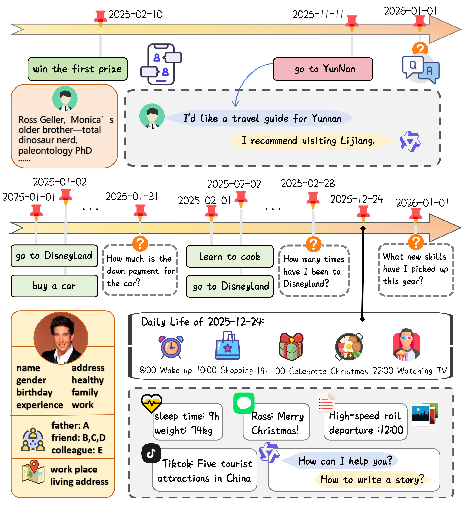
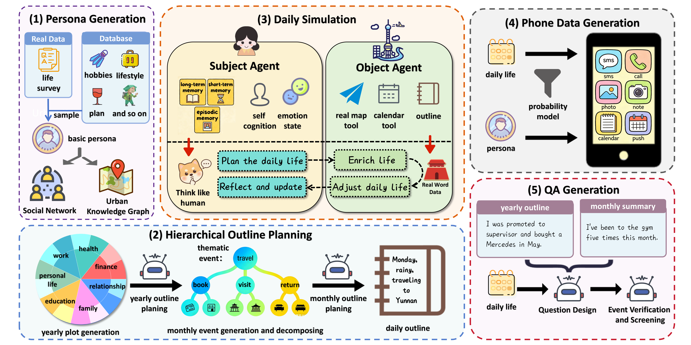

# LifeBench: A Benchmark for Long-Horizon Multi-Source Memory

LifeBench is a benchmark designed for evaluating personalized agent memory systems. It comprises detailed character profile data, a full-year dataset covering all daily life activities of individuals, digital trace (mobile phone operation) data corresponding to real-life scenarios, and the associated question-answering data.

## Overview

## Dataset

The dataset can be found in the `life_bench_data` folder, available in both English and Chinese versions. The dataset contains data from 10 users, with each user having the following files:

- **`phone_data`**: Mobile phone operation data
- **`QA`**: Question-answering data
- **`summary`**: Monthly summaries
- **`daily_event.json`**: Daily activities
- **`location.json`**: Real city addresses
- **`persona.json`**: User profile
- **`daily_draft.json`**: Daily granular outline

### Memory Benchmark Support

For the convenience of conducting memory benchmark tests on existing memory systems (primarily for locomo), we have converted the QA data into the locomo input format. The converted data can be found in `our.json`.

## Data Synthesis Framework Usage

1. **Environment Configuration**: 
   - Run `pip install -r requirements.txt` to install dependencies
   - Configure LLM API and map API keys in `config.json`

2. **Prepare Persona Data**: 
   - Create a persona array (supports multiple users and custom formats)
   - Save it as `data/person.json`

3. **Generate Data**: 
   - Execute `python run_all.py` to start the data synthesis process