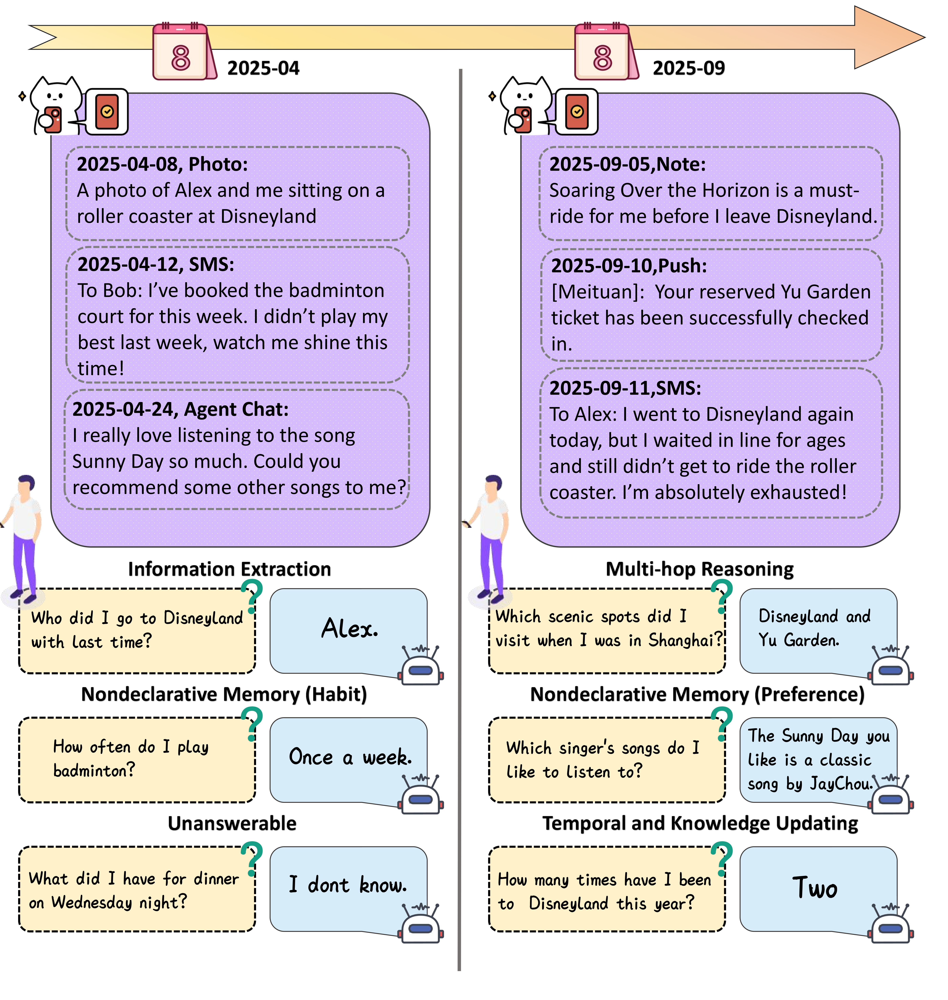

# LifeBench: A Benchmark for Long-Horizon Multi-Source Memory

LifeBench is a benchmark designed for evaluating personalized agent memory systems. It comprises:
- Detailed character profile data
- A full-year dataset covering all daily life activities of individuals
- Digital trace (mobile phone operation) data corresponding to real-life scenarios
- Associated question-answering data

The main objectives of our dataset are as follows:

1. **Challenging question-answering and interactive tasks**
   We aim to design comprehensive, continuous, and dense scenarios that cover real-life interactions between humans and agents/mobile devices, posing rigorous challenges to agent/device interaction capabilities. 
   The current version includes tasks such as single-hop reasoning, multi-hop reasoning, temporal and memory-updating reasoning, and non-declarative memory reasoning. 
   In future work, we plan to introduce additional challenging settings, including conflicting memories, harmful memories (involving privacy and bias), and the ability to retain important memories under massive memory loads.

2. **Long-term, full-coverage personal life and digital trace data**
   Such data can be applied to a wide range of fields, including recommendation systems, research on services for vulnerable groups, game NPC generation, and general data training, rather than being limited to the evaluation of agent memory systems. 
   Therefore, constructing high-quality, realistic, and plausible datasets of this kind is of great importance.

## Example of the data

## Overview

Existing benchmarks mainly focus on dialogue scenarios and lack diverse digital traces. Furthermore, current datasets do not cover continuous, long-term life sequences of an individual, but only concentrate on major events. In contrast, we model continuous data that covers an individual’s entire life over the course of one year.


## Dataset

The dataset can be found in the `life_bench_data` folder, available in both English and Chinese versions. The dataset contains data from 10 users, with each user having the following files:

- **`phone_data`**: Mobile phone operation data
- **`QA`**: Question-answering data
- **`summary`**: Monthly summaries
- **`daily_event.json`**: Daily activities
- **`location.json`**: Real city addresses
- **`persona.json`**: User profile
- **`daily_draft.json`**: Daily granular outline

### Memory Benchmark Support

For the convenience of conducting memory benchmark tests on existing memory systems (primarily for locomo), we have converted the QA data into the locomo input format. The converted data can be found in `our.json`.

## Data Synthesis Framework Usage

1. **Environment Configuration**: 
   - Run `pip install -r requirements.txt` to install dependencies
   - Create `config/config.json` by copying from `config.example.json`
   - Configure LLM API and map API keys in `config/config.json`

2. **Prepare Persona Data**:
   - Create a persona array (supports multiple users and custom formats)
   - Save it as `input/person.json`

3. **Generate Data**:
   - Execute `python scripts/run_all.py` to start the data synthesis process
   - Or run individual scripts in `scripts/run/`:
     - `python scripts/run/persona_gen.py` - Generate persona data
     - `python scripts/run/draft_gen.py` - Generate daily event drafts
     - `python scripts/run/simulator.py` - Simulate daily activities
     - `python scripts/run/phone_gen.py` - Generate phone operation data
     - `python scripts/run/qa_gen.py` - Generate question-answer pairs

## Usage

### Full Pipeline

```bash
# Run the complete generation pipeline for all personas in input/person.json
python scripts/run_all.py

# Specify persona ID range
python scripts/run_all.py --start-id 1 --end-id 5

# Generate phone data only, skip QA generation
python scripts/run_all.py --generate-qa 0
```

### Step-by-Step

```bash
# 1. Generate persona data
python scripts/run/persona_gen.py --base-path <path>

# 2. Generate daily event drafts
python scripts/run/draft_gen.py --base-path <path>

# 3. Simulate daily activities
python scripts/run/simulator.py --base-path <path>

# 4. Generate phone operation data
python scripts/run/phone_gen.py --base-path <path>

# 5. Generate QA data
python scripts/run/qa_gen.py --base-path <path>
```

### Command Line Arguments

| Argument | Description | Default |
|----------|-------------|---------|
| `--base-path` | Base data path | `fenghaoran/` |
| `--process-path` | Process file path (relative) | `process/` |
| `--instance-id` | Persona instance ID | `0` |
| `--max-workers` | Max worker threads | `CPU cores × 2` |
| `--generate-phone-data` | Generate phone data (0/1) | `1` |
| `--generate-monthly-report` | Generate monthly reports (0/1) | `1` |
| `--generate-qa` | Generate QA data (0/1) | `1` |
| `--year` | Year for generated data | `2025` |

## Configuration

Create `config/config.json` from `config.example.json`:

```json
{
  "llm": {
    "api_key": "your_api_key_here",
    "base_url": "https://api.deepseek.com"
  },
  "map_tool": {
    "api_key": "your_map_api_key_here"
  }
}
```

| Config Key | Description | Required |
|------------|-------------|----------|
| `llm.api_key` | LLM API key | Yes |
| `llm.base_url` | LLM API endpoint | Yes |
| `map_tool.api_key` | Map API key (for address generation) | No |

## Directory Structure

```
lifebench/
├── config/
│   ├── config.example.json    # Config template
│   └── config.json           # Actual config (create manually)
├── input/
│   └── person.json           # Input persona data
├── output/                    # Generated data output
│   └── {pinyin_name}_id/    # Per-person folder
│       ├── persona.json      # User persona
│       ├── daily_draft.json   # Daily drafts
│       ├── daily_event.json   # Daily events
│       ├── event_tree.json    # Event tree
│       ├── location.json      # Location data
│       ├── phone_data/        # Phone operation data
│       │   ├── sms.json
│       │   ├── call.json
│       │   ├── calendar.json
│       │   ├── note.json
│       │   ├── photo.json
│       │   ├── push.json
│       │   ├── agent_chat.json
│       │   └── fitness_health.json
│       ├── QA_all/            # QA data aggregation
│       │   └── QA.json
│       └── process/          # Intermediate files
├── scripts/
│   ├── run_all.py           # Batch runner
│   ├── run.py               # Integrated generator
│   └── run/                  # Step-by-step scripts
│       ├── persona_gen.py
│       ├── draft_gen.py
│       ├── simulator.py
│       ├── phone_gen.py
│       └── qa_gen.py
├── src/lifebench/
│   ├── event/
│   │   ├── draft/           # Draft generation
│   │   ├── edit/            # Edit interface
│   │   ├── memory_structure/ # Memory structure
│   │   ├── phone_generator/  # Phone data generator
│   │   ├── qa_generator/    # QA generator
│   │   ├── templates/        # Templates
│   │   └── tools/           # Utilities
│   ├── persona/             # Persona module
│   └── utils/               # Helper functions
├── tests/                   # Test data
├── requirements.txt
└── README.md
```

## Checkpoint

The pipeline supports resumable execution. Intermediate results are saved to `process/` directory.

### Checkpoints by Stage

| Stage | Output Directory | Check File | Description |
|-------|-----------------|------------|-------------|
| **1. persona_gen** | `{base_path}/` | `persona.json` | User persona data |
| **2. draft_gen** | `{base_path}/process/` | `daily_draft.json` | Daily draft data |
| **3. simulator** | `{base_path}/process/` | `event_tree.json`, `daily_event.json` | Simulated events |
| **4. phone_gen** | `{base_path}/phone_data/` | `contact.json` | Phone operation data |
| **5. qa_gen** | `{base_path}/QA_all/` | `QA.json` | Merged QA data |

### Resume Mechanism

- `run_all.py` automatically checks for existing files in `process/`
- If critical files exist, the corresponding stage is skipped
- To force regeneration, delete the files in the corresponding directory
