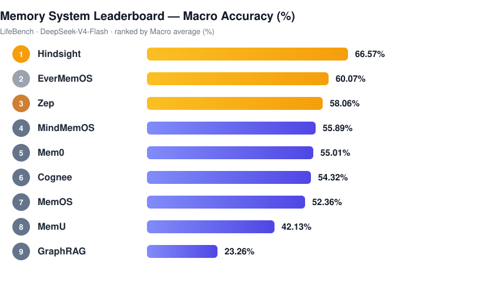

# LifeBench: A Benchmark for Long-Horizon Multi-Source Memory

[](https://huggingface.co/datasets/C1754955896/Lifebenchv2.0)
[](https://arxiv.org/abs/2603.03781)

LifeBench is a benchmark designed for evaluating personalized agent memory systems. It comprises:
- Detailed character profile data
- A full-year dataset covering all daily life activities of individuals
- Digital trace (mobile phone operation) data corresponding to real-life scenarios
- Associated question-answering data

The main objectives of our dataset are as follows:

1. **Challenging and comprehensive question-answering and online interaction tasks** (with interleaved memory augmentation, memory retrieval, and answering)
2. **Long-term, realistic and rich personal life data and digital traces**
3. **Automated pipeline** for data generation and question design, supporting large-scale applications

## 🌐 Overview

Existing benchmarks mainly focus on dialogue scenarios and lack diverse digital traces. Furthermore, current datasets do not cover continuous, long-term life sequences of an individual, but only concentrate on major events. In contrast, we model continuous data that covers an individual's entire life over the course of one year.


### 🧩 Question Categories

LifeBench contains 9 categories of questions:

| Question Category | English Name | Description |
|-------------------|--------------|-------------|
| **Single-hop Reasoning** | Single_hop | Direct information extraction questions based on a single event or mobile phone operation record |
| **Multi-hop Reasoning** | Multi_hop | Complex questions requiring integration of multiple event information and multi-source data correlation analysis |
| **Temporal Reasoning** | Temporal | Questions involving analysis of time dimensions such as event chronology, time intervals, and frequency |
| **Non-declarative Memory** | Non-declarative | Questions identifying user behavior patterns, habit preferences, personality traits, and other patterned information |
| **Knowledge Update Reasoning** | Knowledge_update | Questions tracking changes in user knowledge, hobbies, status, etc. over time, assessing memory update capability |
| **Causal Reasoning** | Causal | Questions analyzing causal relationships between events, behavioral triggers, and chain reactions |
| **Conflict Detection** | Conflict | Questions identifying logical contradictions and time conflicts in mobile data or information |
| **Hidden Information Mining** | Hidden_info | Questions extracting implicit information through correlation analysis of multi-source data |
| **Unanswerable** | Unanswerable | Questions that cannot be answered based on existing data, used for evaluating model refusal capability |

Each question contains: question content, answer, score points (for evaluation), required event IDs, ask time, and other fields.

## 🏆 Leaderboard

Accuracy (%) on LifeBench and LoCoMo. **LifeBench Micro** is the accuracy over all questions, while **Macro** is the arithmetic mean of the nine category accuracies. **Gold Evidence†** feeds the annotated supporting evidence directly to the answer model (a reader under perfect retrieval) and is a reference upper bound — it is not a memory system and is excluded from the per-column best. **Bold** marks the best among memory systems in each column. LoCoMo excludes adversarial questions; `—` = not reported.



<table>
  <thead>
    <tr>
      <th>Base LLM</th>
      <th>Memory System</th>
      <th>SH</th><th>MH</th><th>TR</th><th>ND</th><th>KU</th><th>CR</th><th>CD</th><th>HI</th><th>UA</th><th>Micro</th><th>Macro</th><th>LoCoMo</th>
    </tr>
  </thead>
  <tbody>
    <tr>
      <td rowspan="10">DeepSeek-V4-Flash</td>
      <td>Mem0</td>
      <td>78.09</td><td>41.41</td><td>32.45</td><td>48.48</td><td>75.84</td><td>52.55</td><td>78.07</td><td>32.47</td><td>55.73</td><td>61.54</td><td>55.01</td><td>85.32</td>
    </tr>
    <tr>
      <td>Cognee</td>
      <td>71.69</td><td>37.07</td><td>27.36</td><td>45.44</td><td>72.49</td><td>43.16</td><td>68.63</td><td>30.93</td><td><b>92.14</b></td><td>63.17</td><td>54.32</td><td>81.12</td>
    </tr>
    <tr>
      <td>Hindsight</td>
      <td>83.43</td><td>53.98</td><td>44.34</td><td><b>58.75</b></td><td>85.09</td><td><b>67.83</b></td><td>80.66</td><td><b>49.48</b></td><td>75.56</td><td>71.98</td><td><b>66.57</b></td><td>82.83</td>
    </tr>
    <tr>
      <td>MemU</td>
      <td>60.34</td><td>23.87</td><td>17.92</td><td>23.19</td><td>47.30</td><td>30.29</td><td>62.26</td><td>23.20</td><td>90.77</td><td>52.75</td><td>42.13</td><td>80.26</td>
    </tr>
    <tr>
      <td>MemOS</td>
      <td>72.94</td><td>32.91</td><td>26.98</td><td>33.65</td><td>71.47</td><td>40.21</td><td>68.63</td><td>35.57</td><td>88.89</td><td>61.51</td><td>52.36</td><td>79.40</td>
    </tr>
    <tr>
      <td>EverMemOS</td>
      <td>71.76</td><td>48.55</td><td>38.30</td><td>54.75</td><td>81.23</td><td>59.25</td><td>67.45</td><td>34.02</td><td>85.30</td><td>66.04</td><td>60.07</td><td>80.69</td>
    </tr>
    <tr>
      <td>MindMemOS</td>
      <td>79.83</td><td>42.04</td><td>42.45</td><td>35.36</td><td>69.67</td><td>38.07</td><td><b>84.67</b></td><td>26.80</td><td>84.10</td><td>67.37</td><td>55.89</td><td>86.70</td>
    </tr>
    <tr>
      <td>Zep</td>
      <td>77.78</td><td>49.46</td><td>46.23</td><td>43.92</td><td>73.78</td><td>53.89</td><td>83.25</td><td>39.69</td><td>54.53</td><td>63.85</td><td>58.06</td><td><b>88.84</b></td>
    </tr>
    <tr>
      <td>GraphRAG</td>
      <td>22.10</td><td>12.93</td><td>12.83</td><td>19.77</td><td>16.97</td><td>15.01</td><td>11.08</td><td>10.31</td><td>88.38</td><td>30.50</td><td>23.26</td><td>82.72</td>
    </tr>
    <tr>
      <td><i>Gold Evidence†</i></td>
      <td>98.14</td><td>94.85</td><td>94.91</td><td>93.73</td><td>96.14</td><td>94.10</td><td>98.11</td><td>93.30</td><td>100.00</td><td>97.28</td><td>95.92</td><td>—</td>
    </tr>
    <tr>
      <td rowspan="2">GLM-5.2</td>
      <td>Hindsight</td>
      <td><b>85.60</b></td><td>53.62</td><td>45.85</td><td>56.65</td><td>83.55</td><td>66.76</td><td>80.90</td><td>40.72</td><td>84.79</td><td><b>74.41</b></td><td>66.49</td><td>—</td>
    </tr>
    <tr>
      <td>EverMemOS</td>
      <td>79.64</td><td><b>58.95</b></td><td><b>59.25</b></td><td><b>58.75</b></td><td>84.83</td><td>57.64</td><td>78.54</td><td>40.72</td><td>71.45</td><td>70.95</td><td>65.53</td><td>—</td>
    </tr>
    <tr>
      <td rowspan="2">Qwen-3.8-MAX</td>
      <td>Hindsight</td>
      <td>83.30</td><td>50.72</td><td>38.87</td><td>54.94</td><td>83.29</td><td>64.88</td><td>82.08</td><td>44.85</td><td>85.30</td><td>72.31</td><td>65.36</td><td>—</td>
    </tr>
    <tr>
      <td>EverMemOS</td>
      <td>73.49</td><td>55.06</td><td>55.09</td><td>54.37</td><td><b>86.38</b></td><td>55.50</td><td>72.17</td><td>43.81</td><td>86.84</td><td>69.32</td><td>64.75</td><td>—</td>
    </tr>
  </tbody>
</table>

> **SH** Single-hop · **MH** Multi-hop · **TR** Temporal · **ND** Non-declarative · **KU** Knowledge update · **CR** Causal · **CD** Conflict detection · **HI** Hidden information · **UA** Unanswerable · **Micro** micro-average · **Macro** macro-average (across the 9 categories). † = Gold Evidence reference (perfect retrieval).
>
> 📊 **Interactive version** — sort and explore the full results at [C1754955896/Lifebench-Leaderboard](https://huggingface.co/spaces/C1754955896/Lifebench-Leaderboard).

## 📦 Dataset

The dataset is available on the Hugging Face Hub:

- 🤗 **LifeBench v2.0** — [https://huggingface.co/datasets/C1754955896/Lifebenchv2.0](https://huggingface.co/datasets/C1754955896/Lifebenchv2.0)

It is also included in this repository under [`life_bench_data/version2/`](life_bench_data/version2/), available in both Chinese (`data/`) and English (`data_en/`) versions. The dataset contains data from 10 users; each user has the following files:

- **`persona.json`**: User profile
- **`daily_event.json`**: Daily activities
- **`event_tree.json`**: Hierarchical event tree
- **`daily_draft.json`**: Daily granular outline
- **`phone_data/`**: Mobile phone operation data (9 sources: sms, call, calendar, note, photo, push, fitness_health, contact, agent_chat)
- **`QA_all/QA.json`**: Question-answering data

### 🧠 Memory Benchmark Support

For the convenience of conducting memory benchmark tests on existing memory systems (primarily for locomo), we have converted the QA data into the locomo input format. 

## 🚀 Usage


### ⚙️ Environment Configuration

1. **Install Dependencies**
   ```bash
   pip install -r requirements.txt
   ```

2. **Embedding Model Preparation** (Optional, for memory system)
   Download embedding models to `src/lifebench/event/local_models/` for local similarity search:

   ```bash
   pip install huggingface-hub
   huggingface-cli download sentence-transformers/all-MiniLM-L6-v2 --local-dir src/lifebench/event/local_models/all-MiniLM-L6-v2
   ```


3. **Configuration File**
   - Create `config/config.json` (copy from `config.example.json`)
   - Configure LLM API and map API keys

   ```json
   {
     "llm": {
       "api_key": "your_api_key_here",
       "base_url": "https://api.deepseek.com",
       "default_model": "deepseek-v4-flash",
       "reason_model": "deepseek-v4-pro",
       "strip_think": false
     },
     "simulation_asset_preparation": { "enabled": true, "...": "..." },
     "trajectory_assignment": { "enabled": true, "...": "..." },
     "map_tool": {
       "api_key": "your_map_api_key_here"
     }
   }
   ```

   | Config Key | Description | Required |
   |------------|-------------|----------|
   | `llm.api_key` | LLM API key | Yes |
   | `llm.base_url` | LLM API endpoint (support OpenAI-compatible format) | Yes |
   | `llm.default_model` | Default model for general generation | No |
   | `llm.reason_model` | Reasoning model for complex tasks | No |
   | `llm.strip_think` | Strip `<think>…</think>` from reasoning-model output | No |
   | `simulation_asset_preparation` | Shared-asset preprocessing (fuzzy memory, POI pool) | No |
   | `trajectory_assignment` | Location/trajectory generation parameters | No |
   | `map_tool.api_key` | Map API key (for address generation) | No |

   > **Full configuration reference**: see [`config/README.md`](config/README.md) for every option and its default.

   **Supports any LLM provider compatible with the OpenAI API format** (e.g., DeepSeek, Claude, GPT-4) by configuring different `base_url` and `model` values.

   **Model Selection Strategy**: `default_model` and `reason_model` are designed to **reduce generation costs**.
   - Simple tasks (short context, non-complex reasoning): automatically call `default_model`
   - Long-context tasks (complex reasoning, multi-step generation): automatically call `reason_model`
   - If you do not want to differentiate, configure both fields as the **same model**

### 🛠️ Data Preparation

#### Batch Mode Data Preparation

Merge all persona data into an array and save to `input/person.json`:

```json
[
  {
    "name": "Zhang San",
    "age": 30,
    ...
  },
  {
    "name": "Li Si",
    "age": 25,
    ...
  }
]
```

#### Single Persona Data Preparation

Create a persona folder under `output` and place the persona data:

```
output/
└── fenghaoran/           # Persona folder
    └── persona.json      # Persona data
```

### ▶️ Running

#### Batch Mode

```bash
# Run the complete generation pipeline (process all personas in input/person.json)
python run_all.py

# Specify persona ID range
python run_all.py --start-id 1 --end-id 5

# Skip QA generation (phone data, monthly reports, etc. are still generated)
python run_all.py --generate-qa 0
```

#### Single Persona Mode

**Run all at once with run.py:**

```bash
cd scripts
python run.py --base-path output/fenghaoran
```

**Run step by step:**

```bash
cd scripts

# 1. Generate daily event drafts
python run/draft_gen.py --base-path output/fenghaoran

# 2. Simulate daily activities
python run/simulator.py --file-path output/fenghaoran/

# 3. Generate phone operation data
python run/phone_gen.py --file-path output/fenghaoran/

# 4. Generate question-answer pairs
python run/qa_gen.py --data-path output/fenghaoran/
```

> Each step accepts additional arguments — see [`scripts/run/README.md`](scripts/run/README.md) for the full list.


### 🎛️ Command Line Arguments

| Argument | Description | Default |
|----------|-------------|---------|
| `--base-path` | Base data path | `fenghaoran/` |
| `--process-path` | Process file path (relative to `base-path`) | `process/` |
| `--instance-id` | Persona instance ID | `0` |
| `--max-workers` | Max worker threads | auto (CPU cores × 2) |
| `--generate-phone-data` | Generate phone data (0/1) | `1` |
| `--generate-monthly-report` | Generate monthly reports (0/1) | `1` |
| `--generate-qa` | Generate QA data (0/1) | `1` |
| `--year` | Year for generated data | `2025` |
| `--months` | Number of months to generate | `12` |
| `--interactive` | Interactive draft optimization | off |
| `--no-phone-sample` | Keep all generated phone data (skip sampling) | off |
| `--dry-run` | Write placeholder files without generating | off |

`run_all.py` additionally accepts `--persona-folder` (default `input/`), `--start-id`, `--end-id`, and `--dry-run`.

## 📁 Directory Structure

```
lifebench/
├── config/
│   ├── config.example.json    # Config template (all options + defaults)
│   └── config.json            # Actual config (create manually; not committed)
├── input/
│   └── person.json            # Input persona data (batch mode)
├── output/                    # Generated data output
│   └── {pinyin}_{id}/         # Per-person folder (e.g. feng_haoran_1)
│       ├── persona.json       # User persona
│       ├── daily_draft.json   # Daily drafts
│       ├── daily_event.json   # Daily events
│       ├── event_tree.json    # Event tree
│       ├── location.json      # Location data
│       ├── phone_data/        # Phone operation data
│       │   ├── sms.json
│       │   ├── call.json
│       │   ├── calendar.json
│       │   ├── contact.json
│       │   ├── note.json
│       │   ├── photo.json
│       │   ├── push.json
│       │   ├── agent_chat.json
│       │   └── fitness_health.json
│       ├── summary/           # Monthly health reports
│       ├── QA_all/            # QA data aggregation
│       │   └── QA.json
│       └── process/           # Intermediate files
├── scripts/
│   ├── run_all.py             # Batch runner
│   ├── run.py                 # Integrated generator
│   └── run/                   # Step-by-step scripts
│       ├── persona_gen.py
│       ├── draft_gen.py
│       ├── simulator.py
│       ├── phone_gen.py
│       └── qa_gen.py
├── src/lifebench/
│   ├── event/
│   │   ├── draft/             # Draft generation
│   │   ├── edit/              # Edit interface
│   │   ├── local_models/      # Local embedding models
│   │   ├── memory_structure/  # Memory structure
│   │   ├── phone_generator/   # Phone data generator
│   │   ├── qa_generator/      # QA generator
│   │   ├── simulation/        # Life simulation engine
│   │   ├── templates/         # Templates
│   │   └── tools/             # Utilities
│   ├── memory_file/           # Temporary memory files (cleaned after run)
│   ├── persona/               # Persona module
│   └── utils/                 # Helper functions
├── life_bench_data/           # Released dataset (version1 / version2)
├── tests/                     # Test data
├── requirements.txt
├── pyproject.toml
└── README.md
```

## 💾 Checkpoint

The pipeline supports resumable execution. Intermediate results are saved to base_path directory.

### 📋 Checkpoints by Stage

| Stage | Check File | Description |
|-------|-----------|-------------|
| **1. draft_gen** | `{base_path}/daily_draft.json` | Daily draft data |
| **2. simulator** | `{base_path}/daily_event.json` | Simulated daily events (also `event_tree.json`) |
| **3. event_matching** | — (always runs) | Adds match fields to events |
| **4. monthly_report** | `{base_path}/summary/all_monthly_health_reports.json` | Monthly health reports |
| **5. phone_gen** | `{base_path}/phone_data/contact.json` | Phone operation data |
| **6. qa_gen** | `{base_path}/QA_all/QA.json` | Merged QA data |

> `persona_gen` is a separate pre-step that produces `input/person.json` for batch mode; it is not part of `run.py`'s per-person flow.

### 🔁 Resume Mechanism

- `run.py` automatically checks for existing files in `base_path/`
- If critical files exist, the corresponding stage is skipped
- To force regeneration, delete the files in the corresponding directory

## 📖 Citation

If you use LifeBench in your research, please cite our paper and dataset:

- 📄 **Paper**: [arXiv:2603.03781](https://arxiv.org/abs/2603.03781)
- 🤗 **Dataset**: [C1754955896/Lifebenchv2.0](https://huggingface.co/datasets/C1754955896/Lifebenchv2.0)
