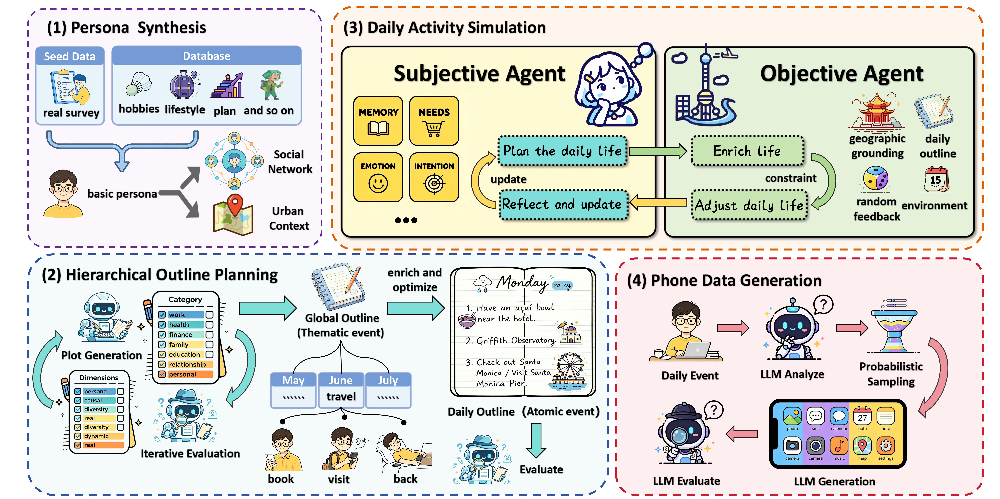
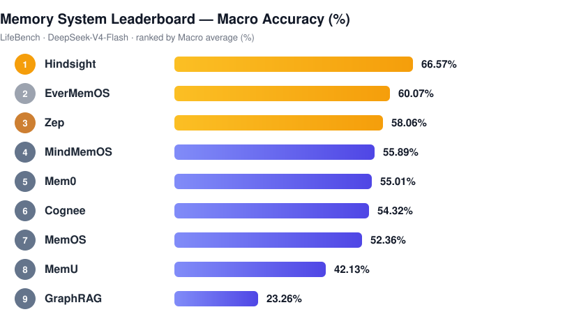

# LifeBench: A Benchmark for Long-Horizon Multi-Source Memory

[](https://huggingface.co/datasets/C1754955896/Lifebenchv2.0)
[](https://arxiv.org/abs/2603.03781)
[](https://github.com/1754955896/LifeBench_eval)

LifeBench combines a life event simulator with a benchmark for personalized agent memory. It generates daily activities and digital traces for virtual users, then tests how well memory agents answer questions about those histories.

[Life Event Simulation](#1-life-event-simulation) | [LifeBench Data](#2-lifebench-data) | [Memory Agents Performance](#3-memory-agents-performance) | [Appendices](#appendices)

## 1. Life Event Simulation

The pipeline turns a persona into a year of connected life events, phone records, and evidence-based questions.



### Simulation Process

| Stage | Output |
|-------|--------|
| Persona preparation | Background, relationships, habits, preferences, and grounded addresses. |
| Daily planning | Event outlines and daily drafts for the selected period. |
| Life simulation | Daily events informed by plans, geographic context, memory, and reflection. |
| Digital trace generation | SMS, calls, calendar entries, notes, photos, notifications, health records, contacts, and assistant conversations. |
| Question generation | Question-answer pairs with supporting evidence and scoring points. |

### Environment Setup

Run LifeBench directly from a cloned repository. All commands below assume the repository root; package installation with `pip install .` is not supported.

```bash
git clone https://github.com/1754955896/LifeBench.git
cd LifeBench
```

Use Python 3.10 or 3.11 in a separate environment and install the dependencies as described in [Appendix A](#a-environment-and-configuration).

The simulator requires a local embedding model. Download it with the [Hugging Face Python API](https://huggingface.co/docs/huggingface_hub/package_reference/file_download#huggingface_hub.snapshot_download):

```bash
python -c "from huggingface_hub import snapshot_download; snapshot_download(repo_id='sentence-transformers/all-MiniLM-L6-v2', local_dir='src/lifebench/event/local_models/all-MiniLM-L6-v2', allow_patterns=['*.json', '*.txt', 'pytorch_model.bin', '1_Pooling/*'])"
```

For a new setup, copy the complete configuration template:

```bash
python -c "from shutil import copyfile; copyfile('config/config.example.json', 'config/config.json')"
```

If `config/config.json` already exists, edit it instead. Set `llm.api_key`, `llm.base_url`, `llm.default_model`, `llm.reason_model`, and `map_tool.api_key` for your providers. Keep the remaining template sections. See the [configuration reference](config/README.md) for all options.

### Run a Simulation

After setup, create a new output directory, copy a complete sample persona, and generate a full year:

```bash
python -c "from pathlib import Path; Path('output/fenghaoran').mkdir(parents=True, exist_ok=True)"
python -c "from shutil import copyfile; copyfile('life_bench_data/version2/data/fenghaoran/persona.json', 'output/fenghaoran/persona.json')"
python scripts/run.py --base-path output/fenghaoran --year 2025 --months 12
```

For an existing run, retain its persona and rerun only the final command with the same time range. The output directory contains daily drafts, daily events, an event tree, phone records, and `QA_all/QA.json`. Choose a separate directory for a different persona or time range.

### Generate New Data

To create new personas, provide source descriptions and run `scripts/run/persona_gen.py` before the simulation. The generator expands each record into a complete profile with relationships and grounded locations.

The example below creates one source description and generates three variants. Run the file preparation commands once in a new working directory:

```bash
python -c "from pathlib import Path; Path('input/generated').mkdir(parents=True, exist_ok=True)"
python -c "from shutil import copyfile; copyfile('src/lifebench/persona/persona_file/refer.json', 'input/generated/refer.json')"
python -c "import json; from pathlib import Path; Path('input/generated/descriptions.json').write_text(json.dumps(['Lives in Yuhang, Hangzhou, works in the internet industry, and enjoys the outdoors.'], indent=2), encoding='utf-8')"
python scripts/run/persona_gen.py --file-path input/generated --ref-file refer.json --input-mode auto --input-format json --input-file descriptions.json --output-file person.json --start 0 --end 1 --variants-per-input 3 --diversity high --seed 42 --as-of-date 2025-01-01
```

This writes `input/generated/person.json` and its aligned `person_locations.json`. Run all generated personas with the batch runner:

```bash
python scripts/run_all.py --persona-folder input/generated --year 2025
```

## 2. LifeBench Data

The released **LifeBench v2.0** dataset is available on Hugging Face: **[C1754955896/Lifebenchv2.0](https://huggingface.co/datasets/C1754955896/Lifebenchv2.0)**.

It contains synthetic life histories for 10 virtual users across 2025, with Chinese and English versions. The statistics below are for **one language version**; translated copies are not counted twice.

| Statistic | Value |
|-----------|-------|
| Virtual users | 10 |
| Time span | January 1 to December 31, 2025 |
| Languages | Chinese and English |
| Daily life events | 57,486 |
| Phone records | 47,409 |
| Phone data sources | 9 |
| Question-answer pairs | 3,380 |
| Question categories | 9 |

The same release is included in [`life_bench_data/version2/`](life_bench_data/version2/):

| Representation | Location |
|----------------|----------|
| Chinese multi-source data | [`data/`](life_bench_data/version2/data/) |
| English multi-source data | [`data_en/`](life_bench_data/version2/data_en/) |
| Chinese and English LoCoMo conversational exports | [`locomo_format/`](life_bench_data/version2/locomo_format/) |

Each multi-source user directory contains a persona, daily drafts and events, an event tree, nine phone data files, and `QA_all/QA.json`. Each LoCoMo export contains 10 user samples and the same 3,380 questions in a conversational representation, not additional QA pairs.

See the [dataset guide](life_bench_data/README.md) for the file layout, [format reference](life_bench_data/version2/README.md) for examples, and [Appendix D](#d-reference-and-citation) for further reference. Reading the released JSON files does not require generation APIs or an embedding model.

## 3. Memory Agents Performance

Use **[LifeBench_eval](https://github.com/1754955896/LifeBench_eval)** to evaluate memory agents on LifeBench. That repository contains the evaluation workflow; this repository provides the simulation pipeline and released data. You can evaluate against the existing dataset without generating new life histories.

Explore and sort results in the **[interactive leaderboard](https://huggingface.co/spaces/C1754955896/Lifebench-Leaderboard)**.

### Leaderboard

Accuracy (%) on LifeBench and LoCoMo. **Micro** is accuracy over all questions; **Macro** is the arithmetic mean across the nine question categories. **Gold Evidence** supplies annotated supporting evidence directly to the answer model and serves as a perfect-retrieval reference, not a memory system. LoCoMo results exclude adversarial questions.



<details>
<summary>Full results by base model, memory system, and question category</summary>

**Bold** marks the best memory-system result in each column. Gold Evidence is excluded from these comparisons. A dash denotes an unreported result.

<table>
  <thead>
    <tr>
      <th>Base LLM</th>
      <th>Memory System</th>
      <th>SH</th><th>MH</th><th>TR</th><th>ND</th><th>KU</th><th>CR</th><th>CD</th><th>HI</th><th>UA</th><th>Micro</th><th>Macro</th><th>LoCoMo</th>
    </tr>
  </thead>
  <tbody>
    <tr>
      <td rowspan="10">DeepSeek-V4-Flash</td>
      <td>Mem0</td>
      <td>78.09</td><td>41.41</td><td>32.45</td><td>48.48</td><td>75.84</td><td>52.55</td><td>78.07</td><td>32.47</td><td>55.73</td><td>61.54</td><td>55.01</td><td>85.32</td>
    </tr>
    <tr>
      <td>Cognee</td>
      <td>71.69</td><td>37.07</td><td>27.36</td><td>45.44</td><td>72.49</td><td>43.16</td><td>68.63</td><td>30.93</td><td><b>92.14</b></td><td>63.17</td><td>54.32</td><td>81.12</td>
    </tr>
    <tr>
      <td>Hindsight</td>
      <td>83.43</td><td>53.98</td><td>44.34</td><td><b>58.75</b></td><td>85.09</td><td><b>67.83</b></td><td>80.66</td><td><b>49.48</b></td><td>75.56</td><td>71.98</td><td><b>66.57</b></td><td>82.83</td>
    </tr>
    <tr>
      <td>MemU</td>
      <td>60.34</td><td>23.87</td><td>17.92</td><td>23.19</td><td>47.30</td><td>30.29</td><td>62.26</td><td>23.20</td><td>90.77</td><td>52.75</td><td>42.13</td><td>80.26</td>
    </tr>
    <tr>
      <td>MemOS</td>
      <td>72.94</td><td>32.91</td><td>26.98</td><td>33.65</td><td>71.47</td><td>40.21</td><td>68.63</td><td>35.57</td><td>88.89</td><td>61.51</td><td>52.36</td><td>79.40</td>
    </tr>
    <tr>
      <td>EverMemOS</td>
      <td>71.76</td><td>48.55</td><td>38.30</td><td>54.75</td><td>81.23</td><td>59.25</td><td>67.45</td><td>34.02</td><td>85.30</td><td>66.04</td><td>60.07</td><td>80.69</td>
    </tr>
    <tr>
      <td>MindMemOS</td>
      <td>79.83</td><td>42.04</td><td>42.45</td><td>35.36</td><td>69.67</td><td>38.07</td><td><b>84.67</b></td><td>26.80</td><td>84.10</td><td>67.37</td><td>55.89</td><td>86.70</td>
    </tr>
    <tr>
      <td>Zep</td>
      <td>77.78</td><td>49.46</td><td>46.23</td><td>43.92</td><td>73.78</td><td>53.89</td><td>83.25</td><td>39.69</td><td>54.53</td><td>63.85</td><td>58.06</td><td><b>88.84</b></td>
    </tr>
    <tr>
      <td>GraphRAG</td>
      <td>22.10</td><td>12.93</td><td>12.83</td><td>19.77</td><td>16.97</td><td>15.01</td><td>11.08</td><td>10.31</td><td>88.38</td><td>30.50</td><td>23.26</td><td>82.72</td>
    </tr>
    <tr>
      <td><i>Gold Evidence†</i></td>
      <td>98.14</td><td>94.85</td><td>94.91</td><td>93.73</td><td>96.14</td><td>94.10</td><td>98.11</td><td>93.30</td><td>100.00</td><td>97.28</td><td>95.92</td><td>—</td>
    </tr>
    <tr>
      <td rowspan="2">GLM-5.2</td>
      <td>Hindsight</td>
      <td><b>85.60</b></td><td>53.62</td><td>45.85</td><td>56.65</td><td>83.55</td><td>66.76</td><td>80.90</td><td>40.72</td><td>84.79</td><td><b>74.41</b></td><td>66.49</td><td>—</td>
    </tr>
    <tr>
      <td>EverMemOS</td>
      <td>79.64</td><td><b>58.95</b></td><td><b>59.25</b></td><td><b>58.75</b></td><td>84.83</td><td>57.64</td><td>78.54</td><td>40.72</td><td>71.45</td><td>70.95</td><td>65.53</td><td>—</td>
    </tr>
    <tr>
      <td rowspan="2">Qwen-3.8-MAX</td>
      <td>Hindsight</td>
      <td>83.30</td><td>50.72</td><td>38.87</td><td>54.94</td><td>83.29</td><td>64.88</td><td>82.08</td><td>44.85</td><td>85.30</td><td>72.31</td><td>65.36</td><td>—</td>
    </tr>
    <tr>
      <td>EverMemOS</td>
      <td>73.49</td><td>55.06</td><td>55.09</td><td>54.37</td><td><b>86.38</b></td><td>55.50</td><td>72.17</td><td>43.81</td><td>86.84</td><td>69.32</td><td>64.75</td><td>—</td>
    </tr>
  </tbody>
</table>

**SH**: Single-hop; **MH**: Multi-hop; **TR**: Temporal; **ND**: Non-declarative; **KU**: Knowledge update; **CR**: Causal; **CD**: Conflict detection; **HI**: Hidden information; **UA**: Unanswerable. The dagger marks Gold Evidence.

</details>

## Appendices

- [A. Environment and Configuration](#a-environment-and-configuration)
- [B. Batch Generation and Resuming](#b-batch-generation-and-resuming)
- [C. Data Visualization](#c-data-visualization)
- [D. Reference and Citation](#d-reference-and-citation)

### A. Environment and Configuration

Use a separate Python 3.10 or 3.11 environment. For example, with Conda:

```bash
conda create -n lifebench python=3.10
conda activate lifebench
python -m pip install -r requirements.txt
```

The embedding model loader checks for `config.json`, `pytorch_model.bin`, `tokenizer_config.json`, and `vocab.txt` in `src/lifebench/event/local_models/all-MiniLM-L6-v2/`.

LLM calls use an OpenAI-compatible endpoint. Set `default_model` and `reason_model` to the same model to use one throughout. Map-backed persona grounding requires a map API key. Keep credentials in the ignored `config/config.json`; full parameter definitions are in [config/README.md](config/README.md).

#### Parameter Configuration

##### Simulation runner

The following options control the integrated single-person runner, `scripts/run.py`:

| Argument | Description | Default |
|----------|-------------|---------|
| `--base-path` | Directory containing `persona.json` | `fenghaoran/` |
| `--process-path` | Intermediate output directory relative to `base-path`; retain the default for the documented workflow | `process/` |
| `--instance-id` | Persona instance ID | `0` |
| `--max-workers` | Worker limit passed to draft generation and simulation; phone generation uses its own setting | automatic |
| `--year` | Simulation year | `2025` |
| `--months` | Number of months, starting in January (1-12) | `12` |
| `--generate-phone-data` | Generate phone data (0/1) | `1` |
| `--generate-monthly-report` | Generate monthly reports (0/1) | `1` |
| `--generate-qa` | Generate QA data (0/1) | `1` |
| `--interactive` | Interactive draft refinement | off |
| `--no-phone-sample` | Keep all generated phone records without sampling | off |
| `--dry-run` | Write placeholder files without generating | off |

To omit QA generation, add `--generate-qa 0`. Other stage switches assume that any data required by later stages is already available. The batch runner accepts a different set of arguments; see [Appendix B](#b-batch-generation-and-resuming).

##### Persona generator

The following options control `scripts/run/persona_gen.py`:

| Argument | Description | Default |
|----------|-------------|---------|
| `--file-path` | Directory containing the input and reference files and receiving generated files | `data/persona/` |
| `--ref-file` | Reference database filename, relative to `file-path`; required by both input modes | `profile_ref.json` |
| `--input-file` | Source-record filename, relative to `file-path` | `processed_features.json` |
| `--input-mode` | `canonical` expects structured feature records; `auto` normalizes natural-language descriptions or structured records and preserves explicit facts | `canonical` |
| `--input-format` | Input container format: `auto`, `json`, `jsonl`, `csv`, `tsv`, `txt`, or `xlsx` | `auto` |
| `--start`, `--end` | Zero-based, end-exclusive source-record range | `0`, `1` |
| `--variants-per-input` | Number of persona variants generated from each source record in `auto` mode | `1` |
| `--diversity` | Variant diversity in `auto` mode: `low`, `medium`, or `high` | `high` |
| `--seed` | Seed for local reference sampling and weighted choices | unset |
| `--as-of-date` | Reference date used to derive age and other date-dependent values | `2021-12-31` |
| `--output-file` | Generated persona-list filename, relative to `file-path` | `persona_list.json` |
| `--skip-location-generation` | Skip grounded address generation and the location sidecar | off |

The default range processes only the first source record, so increase `--end` when supplying more records. A fixed `--seed` makes local sampling repeatable, but does not guarantee identical LLM responses, map results, or final profiles across runs. Excel input additionally requires `openpyxl`; a text file is treated as one source record. See the [persona guide](src/lifebench/persona/README.md) and [persona CLI reference](scripts/run/README.md#1-persona_genpy-persona-generation) for complete schemas and advanced options.

### B. Batch Generation and Resuming

The batch runner reads a `person.json` array and, when present, an aligned `person_locations.json` from the selected input directory:

```bash
# Process the 10 sample personas in input/person.json
python scripts/run_all.py

# Process positions 1 through 5, inclusive
python scripts/run_all.py --start-id 1 --end-id 5

# Generate all stages except QA
python scripts/run_all.py --generate-qa 0
```

Batch-specific options are `--persona-folder` (default `input/`), `--start-id`, and `--end-id` (both default to `0`, meaning no bound at that end). It also accepts `--process-path`, `--max-workers`, the three `--generate-*` switches, `--year`, and `--dry-run`. It always processes full years and does not accept `--base-path`, `--instance-id`, `--months`, `--interactive`, or `--no-phone-sample`.

For selected stages, see the [standalone script reference](scripts/run/README.md). These scripts do not perform every orchestration step in `scripts/run.py`, which also handles event matching, intermediate-file organization, and monthly reports. When calling the phone stage separately, specify the full date range:

```bash
python scripts/run/phone_gen.py --file-path output/fenghaoran/ --start-time 2025-01-01 --end-time 2025-12-31
```

To resume, rerun the original command with the same input, output directory, persona range, and time range. The integrated runner checks existing draft, event, and report files; other stages have their own reuse rules. File existence is not a completeness check. Use a new output directory for a fresh generation instead of selectively deleting dependent artifacts.

### C. Data Visualization

The local viewer requires no Python dependencies, backend server, or generation API.

1. Open the local `html/index.html` file in Chrome or Edge. Keep `index.html`, `app.js`, and `styles.css` together.
2. Select one persona directory containing `daily_event.json`, such as `life_bench_data/version2/data/fenghaoran/`, its `data_en/` equivalent, or a generated directory under `output/`. `persona.json` and `phone_data/` are optional.
3. Choose a date, search events and phone records, filter by record type, and expand entries to inspect their fields and raw JSON.

Files are read locally and are not uploaded. Select the directory again after refreshing. See the [viewer guide](html/README.md) for formats and behavior.

### D. Reference and Citation

| Topic | Reference |
|-------|-----------|
| Dataset layout and file names | [Dataset guide](life_bench_data/README.md) |
| Data fields and examples | [LifeBench v2.0 reference](life_bench_data/version2/README.md) |
| Generation arguments | [Standalone scripts](scripts/run/README.md) |
| Source organization | [LifeBench modules](src/lifebench/README.md) |
| Configuration options | [Configuration reference](config/README.md) |

The nine question categories are single-hop, multi-hop, temporal reasoning, non-declarative memory, knowledge update, causal reasoning, conflict detection, hidden information, and unanswerable questions. QA records include answers, evidence, scoring points, required event IDs, and ask times.

If you use LifeBench in research, cite the [paper (arXiv:2603.03781)](https://arxiv.org/abs/2603.03781) and the [LifeBench v2.0 dataset](https://huggingface.co/datasets/C1754955896/Lifebenchv2.0). The repository includes the [Apache License 2.0](LICENSE).
